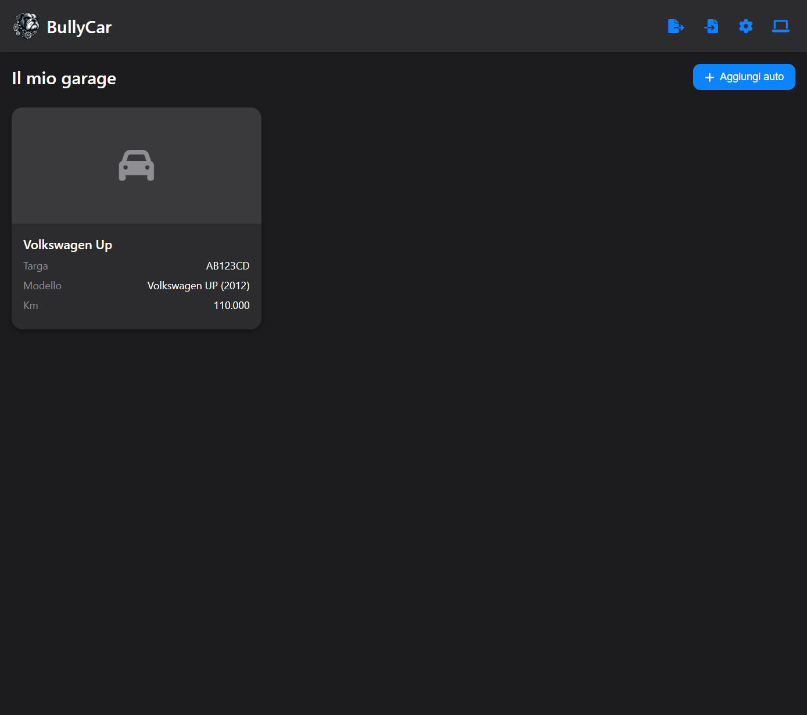

# BullyCar - Gestione Auto

BullyCar è una Progressive Web App (PWA) per la gestione completa delle tue auto. Con un'interfaccia ispirata allo stile iOS/Apple, minimale ma accattivante, ti permette di tenere traccia di tutti gli interventi di manutenzione, scadenze e documenti relativi alle tue auto.

 <!-- Qui uno screenshot del logo con il bulldog inglese -->

## Caratteristiche Principali

- **Garage Virtuale**: Gestisci tutte le tue auto in un unico posto
- **Manutenzione Completa**: Tieni traccia di tagliandi, revisioni, bolli, assicurazioni e interventi personalizzati
- **Promemoria Intelligenti**: Ricevi notifiche per le scadenze imminenti
- **Documenti Digitali**: Conserva il libretto dell'auto e altri documenti in formato PDF
- **Tema Chiaro/Scuro**: Scegli il tema che preferisci o usa quello del sistema
- **Dati Locali**: Tutti i dati vengono salvati localmente sul tuo dispositivo
- **Backup Sicuro**: Esporta e importa i tuoi dati in modo semplice

## Installazione

BullyCar è una PWA, quindi può essere installata su qualsiasi dispositivo con un browser moderno:

1. Apri l'app nel tuo browser: [URL dell'app]
2. Su Desktop: Clicca sull'icona di installazione nella barra degli indirizzi
3. Su Mobile: Scegli "Aggiungi a schermata Home" dal menu del browser

Una volta installata, BullyCar funzionerà anche offline!

## Screenshot

### Vista Garage
 <!-- Screenshot della vista garage con le card delle auto -->

### Dettaglio Auto
 <!-- Screenshot della vista dettaglio auto con i tab -->

### Promemoria Manutenzioni
 <!-- Screenshot del form di manutenzione -->

## Come Usare BullyCar

### Aggiungere una Nuova Auto
1. Clicca su "Aggiungi auto" nella schermata principale
2. Compila i dettagli dell'auto (nome, marca, modello, anno, targa, data di immatricolazione, chilometraggio)
3. Opzionalmente, aggiungi una foto dell'auto e il PDF del libretto
4. Clicca su "Salva"

### Registrare un Intervento di Manutenzione
1. Seleziona un'auto dal garage
2. Vai alla tab "Manutenzione"
3. Clicca su "Aggiungi"
4. Seleziona il tipo di intervento o crea uno personalizzato
5. Inserisci data, chilometraggio e altri dettagli
6. Imposta un promemoria per il prossimo intervento se necessario
7. Clicca su "Salva"

### Gestire i Promemoria
- I promemoria imminenti vengono visualizzati sia nella card dell'auto che nella tab "Promemoria"
- Riceverai notifiche all'apertura dell'app per le scadenze imminenti

### Backup e Ripristino
- Per esportare i dati: Clicca sull'icona di esportazione nell'header
- Per importare un backup: Clicca sull'icona di importazione e seleziona il file .bcar

## Tecnologie Utilizzate

- HTML5, CSS3, JavaScript
- Local Storage per la persistenza dei dati
- PWA per l'esperienza app-like e il funzionamento offline
- Design responsive per desktop e mobile

## ✅ TODO List

Ecco alcune funzionalità che stiamo pianificando di aggiungere:

- [ ] Sincronizzazione cloud per accedere ai dati da più dispositivi
- [ ] Statistiche sui costi di manutenzione
- [ ] Calcolo automatico dei consumi di carburante
- [ ] Condivisione delle manutenzioni con i meccanici
- [ ] Notifiche push per i promemoria

## Contribuire

Se vuoi contribuire al progetto, sei il benvenuto! Puoi farlo nei seguenti modi:

1. Forka il repository
2. Crea un branch per la tua feature (`git checkout -b feature/AmazingFeature`)
3. Commit dei tuoi cambiamenti (`git commit -m 'Add some AmazingFeature'`)
4. Push al branch (`git push origin feature/AmazingFeature`)
5. Apri una Pull Request

## Licenza

Questo progetto è rilasciato sotto licenza MIT. Vedi il file `LICENSE` per maggiori dettagli.

## Contatti

Link al progetto: [https://github.com/carellice/bullycar](https://github.com/carellice/bullycar)

---

Creato con ❤️ da Flavio